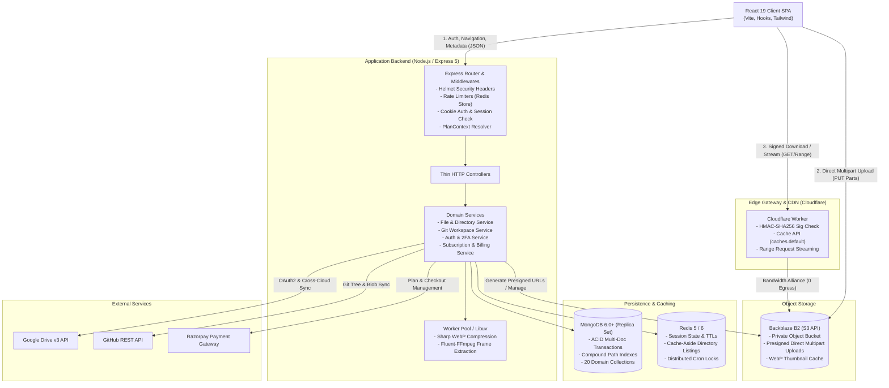
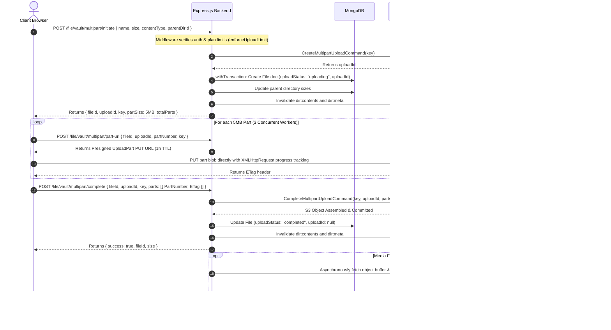
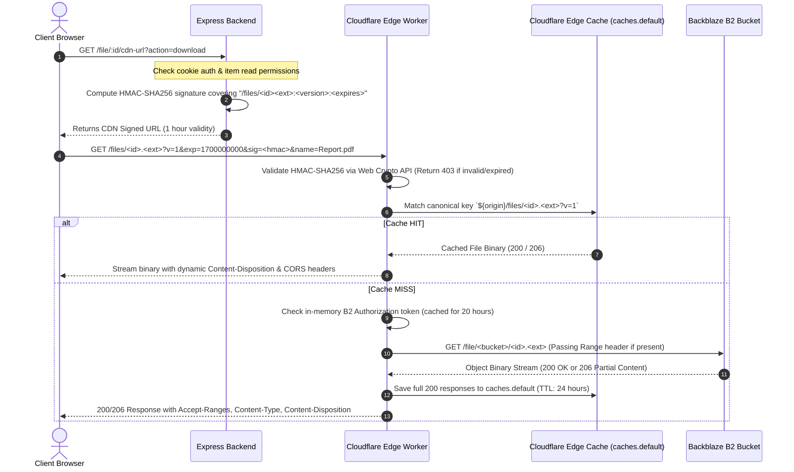
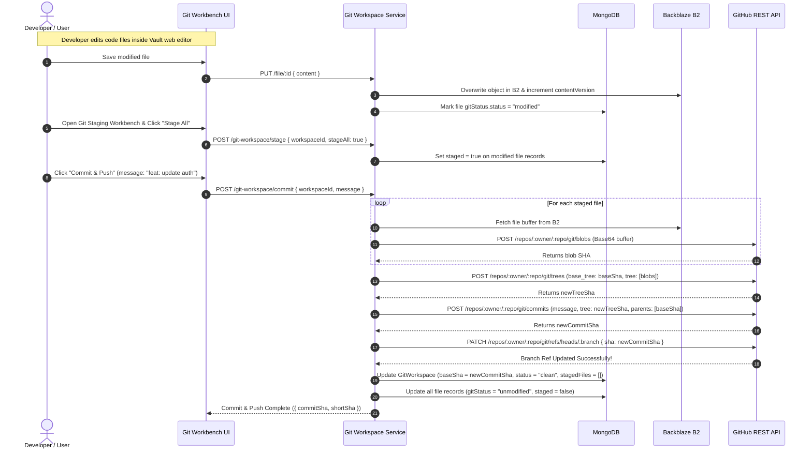

# Vault Storage Architecture & Engineering Manual

This document provides a deep architectural and systems analysis of the **Vault Storage** platform. It details component responsibilities, data flow state machines, cryptographic verification models, caching topologies, and distributed background processing pipelines.

---

## 1. High-Level System Architecture

Vault Storage operates as a multi-tier, decoupled distributed system where client I/O bandwidth is separated from metadata and business logic execution.



---

## 2. Component Responsibilities

### 2.1 Frontend Client (React 19 + Vite)
- **State & Routing**: Modular custom hooks (`useFiles`, `useUploadManager`, `useDownloadManager`, `useClipboard`, `useContextMenu`, `useSelectionBox`, `useSpeedGovernor`).
- **Direct Upload Engine**: Calculates file size thresholds. Files `< 5MB` use single-part signed URLs; files `≥ 5MB` use chunked S3 multipart uploads with a part concurrency limit of 3, pause/resume state retention, and XMLHttpRequest upload progress monitoring.
- **Direct Streaming Downloads**: Integrates the native Web File System Access API (`window.showSaveFilePicker` and `FileSystemWritableFileStream`) to stream multi-gigabyte files directly from the edge CDN to the client's local disk without buffering into browser heap memory.

### 2.2 Application Backend (Express.js 5)
- **Thin Controller Pattern**: Controllers only extract parameters, validate headers/bodies via Zod schemas, invoke domain services, and return responses.
- **Domain Service Layer**: Houses 100% of business logic, transaction boundaries (`withTransaction`), tree traversals, and integration clients.
- **Dynamic Plan Engine (`loadPlanContext`)**: Express middleware that intercepts every request, checks the user's active Razorpay subscription, evaluates plan tier rules (`Free Trial`, `Novice`, `Pro`, `Master`, `Ultimate`), and enforces feature permissions and storage limits declaratively.
- **CPU Worker Offloading**: Sharp and FFmpeg media transformation pipelines execute asynchronously in libuv's C++ worker pool with zero disk I/O, writing generated WebP thumbnails directly into S3.

### 2.3 Edge CDN Gateway (Cloudflare Worker)
- **HMAC-SHA256 Token Verification**: Validates signed token parameters `?v=<version>&exp=<timestamp>&sig=<hmac>` using Web Crypto API.
- **Canonical Edge Caching**: Utilizes `caches.default` matching on `${origin}${pathname}?v=${version}` to cache byte-ranges and complete file objects for 24 hours.
- **Bandwidth Alliance Routing**: Fetches cache misses directly from Backblaze B2 private buckets with zero egress bandwidth charges.
- **Instant Purge API**: `/purge` authenticated endpoint allows the backend to invalidate edge cache entries instantly when files are updated or overwritten.

### 2.4 Persistence Layer (MongoDB & Redis)
- **MongoDB (ACID Transactions)**: Stores file metadata, user sessions, directory hierarchy paths, share links, and plan configurations. Multi-document transactions guarantee that parent directory sizes and path invariants remain consistent even during massive recursive moves or batch deletes.
- **Redis 5 / 6**: Serves as a high-speed cache-aside layer for directory contents (`dir:contents:<id>`), directory metadata counters (`dir:meta:<id>`), active user session tracking (`user_sessions:<userId>`), and distributed cron job locks (`lock:cron:<jobKey>`).

---

## 3. Detailed Data Flow State Machines

### 3.1 Direct-to-S3 Multipart Upload Lifecycle



---

### 3.2 Secure File Delivery & Edge CDN Stream



---

### 3.3 Git Workspace Synchronizer & Commit Engine



---

## 4. Storage Modeling & Path Invariants

Vault represents folder structures using an **Ancestry Path Array** model. Every `Directory` and `File` document contains a `path` field storing an array of ancestor `ObjectId` references from root to self:

$$\text{path} = [\text{rootDirId}, \text{folder1Id}, \text{folder2Id}, \dots, \text{selfId}]$$

### 4.1 Subtree Authorization in \(O(1)\)
To determine if a user or shared token has access to a deeply nested file or directory, the system executes an \(O(1)\) index lookup:

```javascript
// Verification: If parent or any ancestor ID is present in the shared scope
const hasAccess = sharedItemIds.some(sharedId => file.path.includes(sharedId));
```

### 4.2 Transactional Size Rollups
When a file is uploaded, resized, or deleted, the size differential is propagated atomically across all ancestor directories in MongoDB:

```javascript
export const updateParentDirectorySize = async (parentDirIdOrPath, sizeChange, session = null) => {
  if (!parentDirIdOrPath || sizeChange === 0) return;
  
  // Resolve path array
  const path = Array.isArray(parentDirIdOrPath) 
    ? parentDirIdOrPath 
    : (await Directory.findById(parentDirIdOrPath).select("path").session(session))?.path || [];

  if (path.length > 0) {
    // Atomically increment size on all ancestor directories
    await Directory.updateMany(
      { _id: { $in: path } },
      { $inc: { size: sizeChange } },
      { session }
    );
  }
};
```

---

## 5. Background Jobs & Distributed Synchronization

Vault executes scheduled maintenance routines via `node-cron`, protected by distributed Redis mutex locks (`SET lock:cron:<key> "locked" NX EX <ttl>`):

| Job Name | Schedule | Lock TTL | Operational Responsibility |
| :--- | :--- | :--- | :--- |
| **Storage & Trash Purge** | `0 3 * * *` (Daily 03:00 UTC) | 7200s (2h) | Soft-deleted items older than 30 days are permanently purged from MongoDB and Backblaze B2. Storage for unsubscribed users inactive for 60+ days is wiped. |
| **Stale OTP Garbage Collection** | `0 * * * *` (Hourly) | 600s (10m) | Deletes expired email and phone OTP records older than 10 minutes from the `OTP` collection. |
| **Tree Integrity & Size Reconciliation** | `0 4 * * 0` (Sunday 04:00 UTC) | 3600s (1h) | Traverses all directory hierarchies, recalculates subtree size aggregates, corrects orphaned node pointers, and ensures database counters match physical S3 storage. |

---

## 6. Known Architectural Trade-offs & Limitations

1. **Direct Upload Chunk Size**: S3 multipart uploads enforce a minimum chunk size of 5MB per part (except the final part). Files smaller than 5MB are routed through single-part presigned PUT requests.
2. **Local Replica Set Requirement**: MongoDB multi-document transactions require a replica set (`rs0`) in development and production environments.
3. **Bandwidth Alliance Dependency**: Zero-egress CDN benefits require Cloudflare and Backblaze B2 to be configured within the Bandwidth Alliance routing zone.
