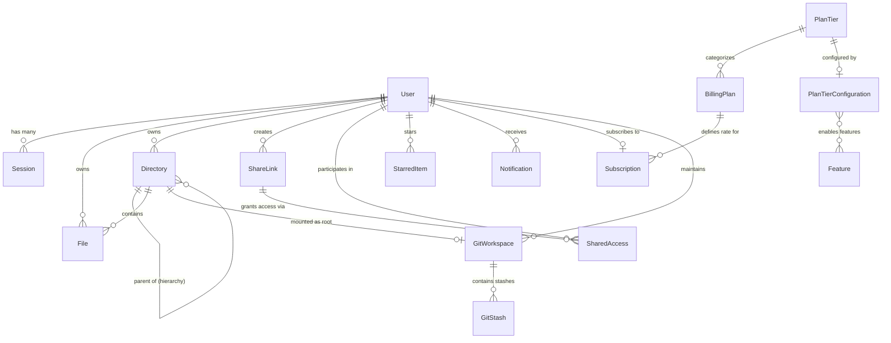

# Vault Storage Data Model & Schema Manual

This document details the complete MongoDB entity-relationship structure, Mongoose schema definitions, indexing strategies, and database invariants of the **Vault Storage** application.

---

## 1. Entity-Relationship Diagram

---

## 2. Core Schemas & Entity Specifications

### 2.1 `User` (`models/userModel.js`)
The central identity and security entity.

| Field | Type | Modifiers / Defaults | Purpose |
| :--- | :--- | :--- | :--- |
| `_id` | `ObjectId` | Primary Key | Unique user identifier. |
| `name` | `String` | `required: true` | User display name. |
| `email` | `String` | `required: true, unique: true` | Verified login email. |
| `password` | `String` | `default: null` | Argon2 hashed password (null for OAuth-only users). |
| `profilepic` | `ObjectId` | `ref: "File", default: null` | Avatar image file stored in Backblaze B2. |
| `rootDirId` | `ObjectId` | `default: null` | Top-level root directory pointer. |
| `maxStorage` | `Number` | `default: 1073741824` (1 GB) | Allocated storage quota in bytes. |
| `role` | `String` | `enum: ["Owner", "Admin", "Manager", "User"]` | RBAC administrative role. |
| `status` | `String` | `enum: ["Active", "Deleted", "Deactivated", "Terminated"]` | Account lifecycle state. |
| `twoFactorEnabled` | `Boolean` | `default: false` | TOTP 2FA activation status. |
| `twoFactorSecret` | `String` | `default: null` | Encrypted base32 TOTP secret. |
| `twoFactorRecoveryCodes` | `Array` | `[{ codeHash, used, usedAt }]` | 10 single-use emergency backup codes. |
| `phone` | `String` | `default: null` | E.164 formatted telephone number. |
| `phoneVerified` | `Boolean` | `default: false` | SMS OTP verification marker. |
| `secondaryRecoveryEmail` | `String` | `default: null` | Account recovery fallback email. |
| `integrations` | `Object` | `{ googleDrive: {...}, github: {...} }` | OAuth2 tokens and synchronization scopes. |
| `subscription` | `ObjectId` | `ref: "Subscription", default: null` | Current active billing subscription. |
| `noSubscriptionSince` | `Date` | `default: null` | Timestamp marking start of 30-day read-only grace period. |

---

### 2.2 `File` (`models/fileModel.js`)
Represents an object stored in Backblaze B2.

| Field | Type | Modifiers / Defaults | Purpose |
| :--- | :--- | :--- | :--- |
| `_id` | `ObjectId` | Primary Key | Used directly as the S3 object key (`${_id}${extension}`). |
| `name` | `String` | `required: true` | Original filename with extension. |
| `userId` | `ObjectId` | `ref: "User", required: true` | Owning user account. |
| `parentDir` | `ObjectId` | `ref: "Directory", default: null` | Containing folder. |
| `extension` | `String` | `default: ""` | File extension (e.g. `.pdf`, `.mp4`). |
| `size` | `Number` | `default: 0` | Physical object size in bytes. |
| `path` | `Array` | `default: []` | Ancestor directory IDs from root to self. |
| `starred` | `Boolean` | `default: false` | Starred bookmark flag. |
| `hasThumbnail` | `Boolean` | `default: false` | Flag indicating WebP thumbnail in `thumbnails/${_id}.webp`. |
| `contentVersion` | `Number` | `default: 1, min: 1` | Incremented on every overwrite to invalidate CDN cache. |
| `uploadStatus` | `String` | `enum: ["completed", "uploading", "failed"]` | Multipart upload lifecycle status. |
| `uploadId` | `String` | `default: null` | S3 Multipart Upload ID for in-flight uploads. |
| `gitStatus` | `Object` | `{ status, staged, originalSha, remoteSha }` | Git workspace tracking metadata. |

**Compound Indexes**:
- `{ userId: 1 }`
- `{ parentDir: 1, userId: 1 }`
- `{ parentDir: 1, name: 1 }`
- `{ userId: 1, starred: 1 }`
- `{ userId: 1, openedAt: -1 }`

---

### 2.3 `Directory` (`models/directoryModel.js`)
Represents a virtual hierarchical folder node.

| Field | Type | Modifiers / Defaults | Purpose |
| :--- | :--- | :--- | :--- |
| `_id` | `ObjectId` | Primary Key | Unique folder identifier. |
| `name` | `String` | `required: true` | Folder name. |
| `userId` | `ObjectId` | `ref: "User", required: true` | Owning user ID. |
| `parentDir` | `ObjectId` | `ref: "Directory", default: null` | Parent directory pointer. |
| `size` | `Number` | `default: 0` | Total recursive size of all contained files and subfolders. |
| `path` | `Array` | `default: []` | Ancestry array `[rootId, parentId, selfId]`. |
| `provider` | `String` | `default: "local"` | `"local"`, `"google_drive"`, or `"git_workspace"`. |
| `gitWorkspace` | `Object` | `{ workspaceId, repoOwner, repoName, branch, baseSha }` | Linked Git repository metadata. |

---

### 2.4 `GitWorkspace` (`models/gitWorkspaceModel.js`)
Maintains the Git repository workspace state for cloned projects.

| Field | Type | Modifiers / Defaults | Purpose |
| :--- | :--- | :--- | :--- |
| `_id` | `ObjectId` | Primary Key | Unique workspace identifier. |
| `userId` | `ObjectId` | `ref: "User", required: true` | Owning developer. |
| `rootDirectoryId` | `ObjectId` | `ref: "Directory", required: true` | Root directory representing the repo root. |
| `repoOwner` | `String` | `required: true` | GitHub repository owner/organization. |
| `repoName` | `String` | `required: true` | GitHub repository name. |
| `branch` | `String` | `default: "main"` | Active working branch. |
| `baseSha` | `String` | `required: true` | Base Git commit tree SHA. |
| `stagedFiles` | `Array` | `[{ path, status, fileId, sha }]` | Staging area working tree index. |
| `status` | `String` | `enum: ["clean", "modified", "conflict", "syncing"]` | Workspace health state. |

---

### 2.5 `Subscription` (`models/subscriptionModel.js`)
Tracks the Razorpay recurring subscription state and billing intervals.

| Field | Type | Modifiers / Defaults | Purpose |
| :--- | :--- | :--- | :--- |
| `_id` | `ObjectId` | Primary Key | Unique subscription record ID. |
| `userId` | `ObjectId` | `ref: "User", required: true` | Subscribing user. |
| `billingPlan` | `ObjectId` | `ref: "BillingPlan"` | Associated plan tier. |
| `razorpaySubscriptionId` | `String` | `required: true, unique: true` | Razorpay subscription reference (`sub_xxx`). |
| `status` | `String` | `enum: ["created", "active", "paused", "halted", "cancelled", "expired"]` | Live payment state. |
| `amount` | `Number` | Currency minor units | Recurring interval price. |
| `currentStart` | `Date` | `default: null` | Current billing period start. |
| `currentEnd` | `Date` | `default: null` | Current billing period end. |
| `cancelAtCycleEnd` | `Boolean` | `default: true` | Graceful cycle-end cancellation flag. |

---

## 3. Database Invariants & Integrity Constraints

1. **Path Array Hierarchy**: For every file and directory, `doc.path[0]` is strictly the user's `rootDirId`, and `doc.path[doc.path.length - 1]` is `doc._id`.
2. **Recursive Size Consistency**: When any file changes in size by $\Delta s$, all directories whose IDs exist in `file.path.slice(0, -1)` have their `size` incremented by $\Delta s$ inside an ACID transaction session.
3. **Orphan Prevention**: Deleting a directory triggers a recursive cascade that purges all child files from Backblaze B2 and MongoDB, with a weekly Sunday reconciliation cron job verifying zero unreferenced storage objects.
