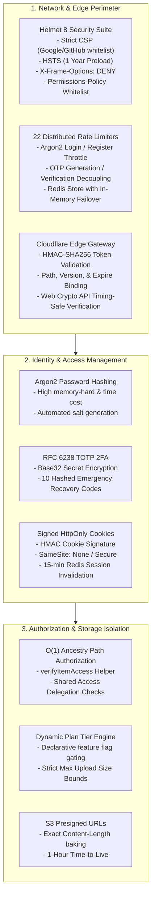

# Vault Storage Security Architecture & Audit Review

This document provides a comprehensive security review of the **Vault Storage** platform, detailing its authentication mechanisms, cryptographic protections, rate limiting policies, and edge CDN access verification.

---

## 1. Security Threat Model & Defense-in-Depth



---

## 2. Cryptographic Controls

### 2.1 Password Hashing (Argon2)
Passwords are never stored in plaintext. Vault uses **Argon2** (`argon2.hash` / `argon2.verify`), the winner of the Password Hashing Competition (PHC). It provides superior resistance against GPU/ASIC-based brute-force attacks compared to legacy bcrypt or PBKDF2:

```javascript
// Pre-save hook on User schema
userSchema.pre("save", async function () {
  if (!this.isModified("password") || !this.password) return;
  this.password = await argon2.hash(this.password);
});
```

### 2.2 RFC 6238 TOTP Two-Factor Authentication
- Two-Factor Authentication is generated using `otplib` and standard Google Authenticator base32 secret formatting.
- Upon 2FA activation, the system generates **10 single-use emergency recovery codes**.
- Each recovery code is hashed (`argon2.hash`) before being stored in the database. When a recovery code is used during login, it is permanently marked as used with a timestamp.

### 2.3 Edge CDN HMAC-SHA256 Signature Verification
File downloads and media thumbnails are delivered through a Cloudflare Edge Worker. The backend signs a download token binding the file path, content version, and expiration timestamp:

$$\text{Signature} = \text{HMAC-SHA256}(\text{CLOUDFLARE\_CDN\_SECRET}, \text{pathname} + ":" + \text{version} + ":" + \text{expires})$$

The Cloudflare Worker validates the signature using the Web Crypto API before serving any file object or contacting Backblaze B2:

```javascript
const validSignature = await crypto.subtle.verify(
  "HMAC",
  key,
  providedSignatureBytes,
  new TextEncoder().encode(`${pathname}:${v}:${expires}`)
);

if (!validSignature) {
  return new Response("Invalid signature.", { status: 403 });
}
```

---

## 3. Session Management & Cookie Security

1. **Signed Session Cookies**: Sessions are identified by a signed `sessionId` cookie. The backend verifies the signature on every incoming request using `cookie-parser(SESSION_SECRET)`.
2. **Cookie Attributes**:
   - `httpOnly: true` (Prevents client-side XSS access).
   - `secure: true` (Enforces HTTPS transmission).
   - `sameSite: "none"` (Permits cross-origin requests from configured frontend origins).
3. **Session Invalidation**:
   - Single device logout deletes the MongoDB session document and Redis key `session:<id>`.
   - "Logout All Devices" queries the Redis set `user_sessions:<userId>` and deletes all active session tokens in parallel.

---

## 4. HTTP Security Headers (Helmet 8 Configuration)

The Express backend implements strict security headers via Helmet 8 (`app.js`):

- **Content Security Policy (CSP)**:
  - `defaultSrc: ["'none'"]`
  - `scriptSrc`: Restricted strictly to `'self'`, `https://accounts.google.com/gsi/client`, and `https://apis.google.com`.
  - `imgSrc`: Restricted to `'self'`, `data:`, `blob:`, `googleusercontent.com`, and `githubusercontent.com`.
  - `connectSrc`: Restricted to `'self'`, `CLIENT_URL`, `accounts.google.com`, `api.github.com`, and `googleapis.com`.
  - `frameAncestors: ["'none'"]` (Prevents clickjacking).
- **Strict Transport Security (HSTS)**: `maxAge: 31536000` (1 year), `includeSubDomains: true`, `preload: true` in production.
- **X-Content-Type-Options**: `nosniff` (Prevents MIME-type sniffing).
- **Referrer-Policy**: `strict-origin-when-cross-origin`.
- **Permissions-Policy**: Disables accelerometer, camera, geolocation, gyroscope, magnetometer, microphone, payment, and usb hardware access.

---

## 5. Multi-Tier Distributed Rate Limiting

Vault configures **22 distinct rate limiters** across authentication, file operations, sharing, and administration. Rate limiters utilize a resilient `FallbackStore` that delegates to Redis when available and falls back to in-memory tracking during connection recovery:

| Limiter | Scope | Window | Limit | Key Generator |
| :--- | :--- | :--- | :--- | :--- |
| `registerLimiter` | Account Registration | 1 hour | 5 requests | IP / Session |
| `loginLimiter` | Account Login | 15 mins | 15 requests | IP / Session |
| `twoFactorLimiter` | 2FA Verification | 15 mins | 15 requests | IP / Session |
| `otpSendLimiter` | Email OTP Dispatch | 15 mins | 5 requests | IP / Session |
| `otpVerifyLimiter` | Email OTP Verification | 15 mins | 15 requests | IP / Session |
| `uploadLimiter` | File Upload Initiation | 15 mins | 60 requests | User ID |
| `directoryReadLimiter` | Folder Navigation | 1 min | 1,200 requests | User ID |
| `thumbnailLimiter` | Thumbnail Grid Feeds | 1 min | 800 requests | User ID |
| `heavyOpLimiter` | Zip Exports / Batch Ops | 15 mins | 10 requests | User ID |
| `adminLimiter` | User Role / Status Edits | 1 min | 100 requests | User ID |

---

## 6. Security Limitations & Recommended Hardening

1. **Virus & Malware Scanning**: Uploads currently rely on MIME-type and extension validation. Integrating an asynchronous ClamAV daemon or AWS GuardDuty malware scan for uploaded S3 objects is recommended for enterprise deployment.
2. **Server-Side File Encryption at Rest (CMEK)**: Storage objects in Backblaze B2 are protected by standard S3 server-side encryption. User-controlled Customer-Managed Encryption Keys (CMEK) can be added for zero-knowledge privacy.
3. **Database Audit Logging**: Sensitive administrative actions (`user role changes`, `account status modifications`) are executed transactionally; exporting an immutable audit log to CloudWatch or Datadog is recommended for SOC-2 compliance.
